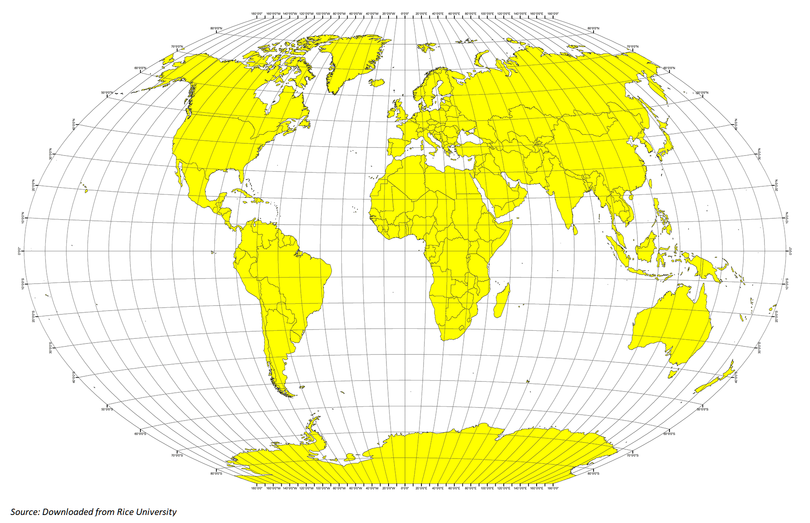

# Global Weather Analysis
## Project Idea
As many scientists recognized that the angle of the sun beaming at the earth and the sunlight intensity/ radiation are varied by latitude, weather conditions are expected to be different around the world. Of course, there are other factors contributed to the variation of the global climate, but in this project, the main focus is to "examine" the latitude factor.

## Overview
There are two Python files in this repository. The use of each will be further explained.
* WeatherPy.ipynb
* VacationPy.ipynb

### Languages, Tools and Techniques
* Python | Pandas | MatPlotLib | Gmaps | APIs | JSON | NumPy |  SciPy | Math | CityPy
* List Comprehension | DataFrame | Linear Regression
Note: CityPy is for looking up nearest cities by geo-coordinates

### Work Flow
* Randomly create 500+ coordinates/ cities scattered around the world
* Perform analysis on weather conditions at generated locations
* Build JSON to retrieve data from API host and select relevant data
* Plot weather conditions and find relationship between weather parameters with latitudes

### Summary of Observations
Repository of API codes and Data Analytics Results

### 
